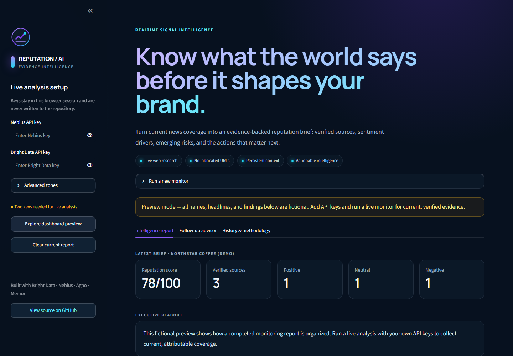
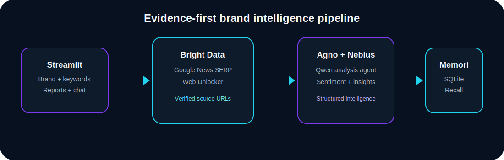

<div align="center">
  
  <h1>Brand Reputation Monitor</h1>
  <p><strong>Evidence-first brand intelligence, powered by live news and agentic AI.</strong></p>
  <p>Turn current coverage into a decision-ready reputation brief with verified sources, sentiment drivers, emerging risks, strategic opportunities, and memory-aware follow-up answers.</p>

  [](https://tirth1263.github.io/brand-reputation-monitor/)
  [](https://www.python.org/)
  [](https://streamlit.io/)
  [](LICENSE)
</div>

---

## Why this project

Brand teams do not need another feed of mentions. They need to know what changed, what it means, how confident the evidence is, and what to do next.

Brand Reputation Monitor follows an evidence-first pipeline: Bright Data collects current Google News results and readable article content; an Agno agent running on Nebius converts those sources into structured sentiment and reputation intelligence; Memori with SQLite preserves conversational context so follow-up answers remain consistent. Source URLs are attached after analysis from immutable collection IDs, which prevents the language model from inventing citations.



## Live demo

**Public hosted preview:** [https://tirth1263.github.io/brand-reputation-monitor/](https://tirth1263.github.io/brand-reputation-monitor/)

The hosted GitHub Pages edition is an interactive, clearly labeled fictional preview of the complete product experience. The repository also includes two server-backed live editions: the primary Streamlit implementation (`app.py`) with Agno and Memori, plus a Next.js route that preserves collection provenance and supports BYOK deployment on a Node host. GitHub Pages cannot execute either server runtime, so it intentionally disables live API submission instead of exposing keys or presenting a broken workflow.

For a live deployment, use the one-click Render blueprint below. In the Streamlit edition, keys are kept in the active application session and are not committed to this repository.

## What it delivers

| Capability | What you receive |
|---|---|
| Live news research | Keyword-driven Google News discovery through Bright Data's SERP API |
| Article-level evidence | Web Unlocker extraction with the exact URLs returned during research |
| Sentiment intelligence | Positive, negative, and neutral classifications with drivers and scores |
| Reputation score | A concise 0–100 indicator for the collected coverage window |
| Strategic analysis | Executive summary, risks, opportunities, insights, and next actions |
| Context-aware advisor | Natural-language follow-up grounded in the current report and recalled context |
| Persistent history | Local SQLite report history plus Memori conversation augmentation |
| Portable output | Downloadable, structured JSON for downstream reporting or automation |

### Product principles

- **Evidence over fluency:** the live workflow includes only public HTTP(S) sources actually returned by research.
- **Provenance by construction:** the model receives immutable `source_id` values, not permission to create links. Verified URLs are reattached in application code.
- **Untrusted content stays data:** scraped article text is explicitly treated as untrusted input, reducing prompt-injection risk.
- **Useful without a manual:** a guided setup, progressive status messages, responsive dashboard, and fictional preview make the workflow self-explanatory.
- **Secrets stay out of Git:** API keys, `.env`, Streamlit secrets, and SQLite runtime files are ignored by default.

## Architecture



### Monitoring workflow

1. **Configure the monitor** — enter a company and focused angles such as `news`, `reviews`, `controversy`, or `announcement`.
2. **Collect current coverage** — Bright Data's SERP zone queries Google News and returns candidate source URLs.
3. **Read source content** — Web Unlocker retrieves accessible article pages; the parser removes navigation and other low-signal markup.
4. **Analyze reputation signals** — an Agno agent uses the configured Nebius model to produce strict JSON with sentiment, drivers, risks, opportunities, and recommendations.
5. **Enforce provenance** — the application matches the agent's results to source IDs and attaches the original collected URLs. Any URL emitted by a model is ignored.
6. **Persist context** — the report and chat audit log are stored in SQLite. Memori registers the Nebius OpenAI-compatible client for context capture and semantic recall.
7. **Continue the conversation** — follow-up questions search recalled context before generating a source-grounded answer.

## Technology stack

| Layer | Technology | Responsibility |
|---|---|---|
| Interface | [Streamlit](https://streamlit.io/) + Plotly | Responsive monitoring workflow, dashboard, charts, chat, and export |
| Web intelligence | [Bright Data](https://brightdata.com/) | Google News SERP collection and Web Unlocker article retrieval |
| Agent orchestration | [Agno](https://www.agno.com/) | Evidence-constrained analysis agent and model execution |
| Model provider | [Nebius AI Studio](https://studio.nebius.com/) | OpenAI-compatible inference for analysis and follow-up answers |
| Default model | `Qwen/Qwen3-Coder-480B-A35B-Instruct` | Configurable structured reasoning model |
| Persistent memory | [Memori](https://memorilabs.ai/) + SQLite | Conversation capture, recall, and local report history |
| Validation | Pydantic + pytest | Typed reports and provenance-focused automated tests |

## Getting started

### Prerequisites

- Python 3.11 recommended (Python 3.10+ is supported by the project design)
- A [Nebius AI Studio API key](https://studio.nebius.com/)
- A [Bright Data API key](https://brightdata.com/) with a SERP zone and Web Unlocker zone
- SQLite, included with Python

### Installation

1. Clone the repository:

   ```bash
   git clone https://github.com/tirth1263/brand-reputation-monitor.git
   cd brand-reputation-monitor
   ```

2. Create and activate a virtual environment:

   ```bash
   python -m venv .venv
   # Windows
   .venv\Scripts\activate
   # macOS / Linux
   source .venv/bin/activate
   ```

3. Install dependencies:

   ```bash
   pip install -r requirements.txt
   ```

   Or, with `uv`:

   ```bash
   uv sync
   ```

4. Create `.env` from the safe template:

   ```bash
   cp .env.example .env
   ```

   On Windows PowerShell:

   ```powershell
   Copy-Item .env.example .env
   ```

5. Add your credentials:

   ```dotenv
   NEBIUS_API_KEY=your_nebius_api_key
   BRIGHTDATA_API_KEY=your_brightdata_api_key

   # These defaults match the project description and can be changed.
   NEBIUS_MODEL=Qwen/Qwen3-Coder-480B-A35B-Instruct
   BRIGHTDATA_SERP_ZONE=sdk_serp
   BRIGHTDATA_UNLOCKER_ZONE=unlocker
   ```

6. Start the app:

   ```bash
   streamlit run app.py
   ```

   Streamlit prints the browser URL. You can also enter credentials directly in the sidebar instead of using `.env`.

## Using the monitor

### Example: product reputation

- Company: `Apple`
- Monitoring angles: `news, reviews, controversy, announcement`
- Useful follow-up: `Which sentiment driver appears most often, and what should the communications team do this week?`

### Example: crisis triage

- Company: `Your company`
- Monitoring angles: `recall, outage, complaints, executive response`
- Useful follow-up: `Separate confirmed risks from speculation and draft a three-step response plan.`

### Example: campaign measurement

- Company: `Your campaign or product name`
- Monitoring angles: `launch coverage, reviewer reaction, customer response`
- Useful follow-up: `Which messages are being repeated positively, and which are not landing?`

## Configuration

The human-readable defaults live in [`config.json`](config.json). Environment variables take precedence.

| Variable | Required | Default | Purpose |
|---|---:|---|---|
| `NEBIUS_API_KEY` | Live runs | — | Nebius inference authentication |
| `NEBIUS_BASE_URL` | No | `https://api.studio.nebius.com/v1/` | OpenAI-compatible endpoint |
| `NEBIUS_MODEL` | No | `Qwen/Qwen3-Coder-480B-A35B-Instruct` | Model identifier |
| `BRIGHTDATA_API_KEY` | Live runs | — | Bright Data REST API authentication |
| `BRIGHTDATA_SERP_ZONE` | No | `sdk_serp` | Google News search zone |
| `BRIGHTDATA_UNLOCKER_ZONE` | No | `unlocker` | Article extraction zone |
| `MEMORI_API_KEY` | No | — | Optional higher Memori augmentation quota |

Zone names are account-specific. If your Bright Data dashboard uses different names, change them in the sidebar or environment.

## File structure

```text
brand-reputation-monitor/
├── app/                       # Next.js public web companion and server route
├── .github/workflows/         # Automated public Pages deployment
├── app.py                    # Streamlit UI and conversational workflow
├── workflow.py               # Collection, analysis, provenance, and memory services
├── config.json               # Safe application defaults
├── requirements.txt          # Runtime dependencies
├── requirements-dev.txt      # Test and lint dependencies
├── pyproject.toml            # Ruff and pytest configuration
├── package.json              # Hosted web companion dependencies and scripts
├── render.yaml               # One-click Render blueprint
├── Dockerfile                # Portable container deployment
├── Procfile                  # Generic Python web-process command
├── runtime.txt               # Hosted Python runtime preference
├── .streamlit/config.toml    # Theme and server configuration
├── .env.example              # Credential template with no secrets
├── assets/
│   ├── logo.svg              # Project identity
│   └── architecture.svg      # README and in-app architecture visual
├── tests/
│   └── test_workflow.py      # Parsing, validation, provenance, and persistence tests
├── CONTRIBUTING.md
├── SECURITY.md
├── LICENSE
└── README.md
```

`memori.db` is created automatically on the first run and intentionally excluded from version control.

## Testing and quality checks

Install development dependencies, then run:

```bash
pip install -r requirements-dev.txt
ruff check .
pytest
```

The test suite specifically verifies that a model response cannot replace a URL collected by the research layer.

## Deployment

### Public GitHub Pages preview

The repository automatically publishes the interactive preview on every push to `main`:

**[Open the hosted website →](https://tirth1263.github.io/brand-reputation-monitor/)**

The Pages workflow builds with a base path and static runtime flag. Preview navigation, dashboard interactions, methodology, and source-code links work publicly; live credential submission is disabled because GitHub Pages has no secure server runtime.

### Render

The repository includes a ready-to-use [`render.yaml`](render.yaml):

[](https://render.com/deploy?repo=https://github.com/tirth1263/brand-reputation-monitor)

Set API keys in Render's encrypted environment settings if the deployment should use owner-managed credentials. For a public bring-your-own-key experience, leave them unset; visitors can enter keys per session.

### Streamlit Community Cloud

1. Create an app from this GitHub repository.
2. Set the entry point to `app.py`.
3. Add credentials under **App settings → Secrets** only if you want server-managed keys.
4. Deploy and verify `/_stcore/health` returns a healthy response.

### Docker

```bash
docker build -t brand-reputation-monitor .
docker run --rm -p 8501:8501 --env-file .env brand-reputation-monitor
```

For production, place the container behind HTTPS, use encrypted secrets, restrict outbound destinations where practical, and choose persistent storage if report history must survive restarts.

## Troubleshooting

### Nebius authentication or model errors

- Verify `NEBIUS_API_KEY`, base URL, and current access to the configured model.
- Model catalogs change; set `NEBIUS_MODEL` to a model available in your Nebius account if the default is unavailable.
- Confirm the endpoint is OpenAI-compatible and ends in `/v1/`.

### Bright Data returns 401 or 403

- Check that the API key is active and the specified zone exists.
- Confirm the SERP zone can access Google and the Unlocker zone can access the target publisher.
- Zone names in this repository are defaults, not universal account IDs.

### No usable articles are found

- Use broader monitoring angles or fewer quoted phrases.
- Check that the Google News SERP response contains public result URLs.
- Some publishers block extraction; the application retains the attributable search snippet instead of fabricating article content.

### Memori initialization warning

- Confirm the project directory is writable.
- Delete only your own local `memori.db` if you intentionally want a fresh memory store.
- The application keeps an auditable SQLite context log if Memori augmentation is temporarily unavailable.

### Analysis takes several minutes

Each live run performs search, source retrieval, and model analysis. More sources increase cost and latency. Start with 5–8 sources for an interactive workflow.

## Responsible use

This project summarizes public web coverage; it does not determine truth, intent, or legal liability. Treat sentiment and scores as decision support, review original sources, correct errors, respect data-access terms and privacy obligations, and use human judgment for consequential brand or crisis decisions.

## Contributing

Contributions are welcome. Read [`CONTRIBUTING.md`](CONTRIBUTING.md), open a focused branch, include tests, and submit a pull request. Security issues should follow [`SECURITY.md`](SECURITY.md).

## License

Released under the [MIT License](LICENSE).

<div align="center">
  <sub>Designed and built by <a href="https://github.com/tirth1263">Tirth Rank</a> · If this project helps you, consider starring the repository.</sub>
</div>
